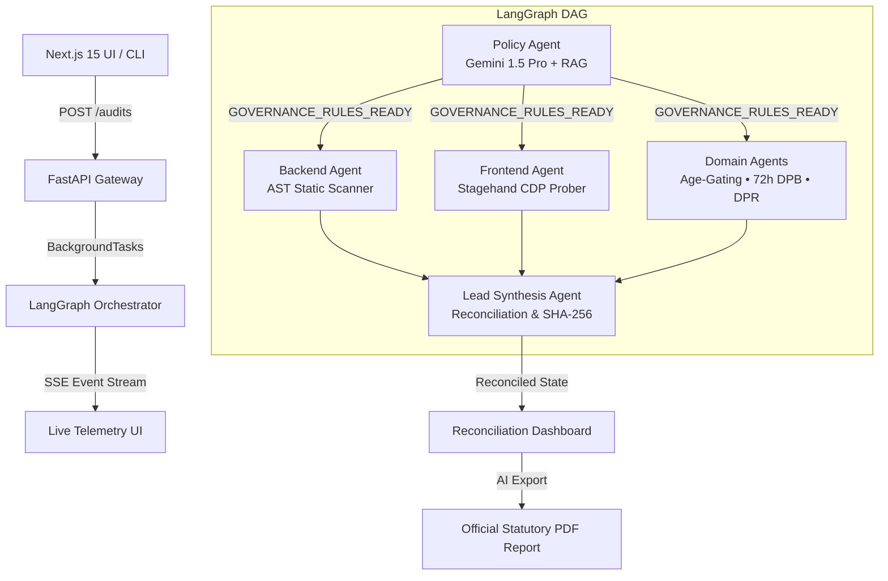

# 🛡️ DPDP 360° AI Compliance Auditor

> **Autonomous Multi-Agent Statutory Verification & Real-Time Remediation Engine**  
> Tailored for India’s **Digital Personal Data Protection (DPDP) Act, 2023 (Act No. 22 of 2023)** & **DPDP Rules, 2025**.

---

## 📌 Executive Overview

The **DPDP 360° AI Compliance Auditor** is an enterprise-grade statutory compliance verification engine built to address the critical statutory liabilities under the DPDP Act 2023 (penalties up to **₹250 Crores / $30M USD** per statutory violation under Section 33).

Unlike conventional static scanners or generic AI wrappers, this system operates a **LangGraph-orchestrated Multi-Agent Directed Acyclic Graph (DAG)** that performs **360° cross-plane statutory reconciliation**:
1. **Frontend Consent Plane**: Intercepts DOM AXTree, cookies, and network tracking prior to affirmative consent (Sec 5(1), Sec 6(1), Rules 3–4).
2. **Backend Static Analysis Plane**: Performs ephemeral Abstract Syntax Tree (AST) scanning across source repositories to detect plaintext PII logging, unencrypted data stores, and missing retention timers (Sec 8(5), Sec 8(7), Rule 6, Rule 8).
3. **Legal Notice & DPA Plane**: Ingests Privacy Policies and Vendor Data Processing Agreements (DPA) transiently into memory, extracting itemized statutory claims via pgvector RAG (Sec 5(1), Sec 8(1), Rule 5).
4. **Domain Extensions Plane**: Automated Verifiable Parental Consent (VPC) age-gating verification (Sec 9(1)), 72-Hour Data Protection Board (DPB) breach notification pipeline (Sec 8(6), Rule 7), and Data Principal Rights (DPR) erasure workflows (Sec 11–14).
5. **Synthesis & Tamper-Evident State Plane**: Cross-plane reconciliation matrix, zero-tolerance critical capping, and cryptographic SHA-256 state seal generation.

---

## 🚀 Live Deployments & Endpoints

| Service | Jurisdiction | Deployed URL | Status |
| :--- | :--- | :--- | :--- |
| **Cloud Run API Gateway** | `asia-south1` (Mumbai, India) | `https://dpdp-auditor-api-3ryg6y5r3q-el.a.run.app` | `HTTP 200 OK` |
| **Interactive Web Application** | Global Edge / Local | `http://localhost:3000` / Cloud Deployed | `Active` |
| **Statutory Data Residency** | `asia-south1` | **SR-1 Statutory Compliance Certified** | `Enforced` |

---

## 🧠 Google Cloud & Generative AI Services Utilized

| Gen AI / GCP Service | Purpose & Implementation Location | Statutory Grounding |
| :--- | :--- | :--- |
| **Google Cloud Run** | Serverless container execution hosting the FastAPI gateway and LangGraph DAG in `asia-south1`. | Section 8(5) (Reasonable Security Safeguards) & Data Residency SR-1 |
| **Vertex AI Gemini 1.5 Pro** (`gemini-1.5-pro`) | Lead legal reasoning engine in `apps/api/agents/policy_agent.py` and `apps/api/agents/synthesis_agent.py` for statutory claim extraction, cross-referencing legal promises with technical telemetry, and generating AI Statutory Executive Memorandums. | Section 5(1), Section 6(1), Section 33 |
| **Vertex AI Gemini 1.5 Flash** (`gemini-1.5-flash`) | High-speed AST static analysis, Semgrep rule interpretation, unified diff patch generation, and real-time remediation in `apps/api/agents/backend_agent.py`. | Section 8(5), Section 8(7) |
| **Vertex AI Text Embeddings** (`text-embedding-004`) | 768-dimensional statutory semantic vector embeddings in `apps/api/tools/embeddings.py` used to ground findings against statutory chunks of the DPDP Act 2023 and DPDP Rules 2025. | Invariant 3 (Strict Statutory Grounding) |
| **Google Cloud Pub/Sub / EventBus** | Asynchronous multi-agent event dispatching (`GOVERNANCE_RULES_READY`, `TELEMETRY_LOG`, `AUDIT_COMPLETED`) over Server-Sent Events (SSE). | Real-Time Telemetry Streaming |

---

## 🏗️ Multi-Agent Architecture (LangGraph DAG)



---

## 🛡️ Six Core Statutory Compliance Domains

1. **Frontend Consent & Notice (25% Weight)**: Verifies affirmative, unbundled, itemized consent notices under Section 5(1) and Section 6(1). Prohibits pre-ticked checkboxes and pre-consent tracking cookies.
2. **Backend Security & PII Protection (25% Weight)**: AST scanning for plaintext PII logging in application logs and unencrypted database stores under Section 8(5) and Rule 6.
3. **Legal Notice & DPA Alignment (20% Weight)**: Cross-plane reconciliation between legal policy commitments and actual network/backend data flows under Section 5(1) and Section 8(1).
4. **Children's Data Protection & Age-Gating (10% Weight)**: Verification of age-gating mechanisms, Verifiable Parental Consent (VPC), and prohibition of behavioral tracking on minors under Section 9(1)–(3) and Rule 10.
5. **Incident Management & 72h DPB Notification (10% Weight)**: Automated incident ingestion and 72-hour statutory breach reporting to the Data Protection Board of India under Section 8(6) and Rule 7.
6. **Data Principal Rights (DPR) & Redressal (10% Weight)**: Automated data erasure upon consent withdrawal (Section 8(7)(b)), self-service data access, and grievance redressal channels under Section 11–14.

> **Zero-Tolerance Critical Cap**: If any `CRITICAL` statutory misrepresentation or pre-consent tracker finding is detected, the final DPDP Compliance Index is capped at **≤59% (FAIL)**.

---

## 🔒 Architectural Invariants & Privacy Guarantees

* **Invariant 1**: Deterministic multi-tenant isolation enforced via PostgreSQL Row-Level Security (RLS).
* **Invariant 2**: **Zero Persistent Code/Doc Storage**: Cloned git repositories and uploaded legal PDFs exist transiently in-memory and are purged immediately upon execution completion.
* **Invariant 3**: **Strict Statutory Grounding**: Every compliance finding cites an explicit DPDP Act Section or Rule clause (`act_section` & `rules_clause` non-null).
* **Invariant 4**: **PII Masking**: Raw PII is never stored or logged in audit state tables.
* **Invariant 5**: **Data Residency (SR-1)**: All compute, models, and databases are hosted in `asia-south1` (Mumbai, India).

---

## 📦 Project Structure

```text
dpdp-auditor/
├── apps/
│   ├── api/                     # FastAPI Backend Gateway & LangGraph Multi-Agent Engine
│   │   ├── agents/              # Multi-Agent DAG definitions
│   │   │   ├── policy_agent.py
│   │   │   ├── backend_agent.py
│   │   │   ├── frontend_agent.py
│   │   │   ├── incident_management_agent.py
│   │   │   ├── child_safety_agent.py
│   │   │   ├── dpr_portal_agent.py
│   │   │   └── synthesis_agent.py
│   │   ├── routers/             # FastAPI Endpoints (/audits, /telemetry, /patches)
│   │   ├── tools/               # AST Scanner, EventBus, RAG Embeddings, Sandbox Runner
│   │   └── main.py
│   └── web/                     # Next.js 15 App Router Frontend
│       ├── app/                 # Pages: /, /telemetry, /dashboard, /login
│       ├── components/          # Reusable UI components & Statutory Report Modal
│       └── lib/                 # API client, SSE hooks, AI Report Synthesizer
├── sample-docs/                 # Sample generated statutory compliance policies
│   ├── Personal_Gemini_Journal_Privacy_Policy.pdf
│   └── Personal_Gemini_Journal_DPA.pdf
├── supabase/                    # PostgreSQL Schema, RLS & pgvector migrations
│   └── migrations/0001_init.sql
├── Dockerfile                   # Cloud Run production container build
├── .env.example                 # Environment configuration template
└── README.md
```

---

## 💻 Local Setup & Development

### 1. Prerequisites
- **Node.js**: `v20+`
- **Python**: `3.12+`
- **Supabase Project** (or local PostgreSQL with pgvector)
- **Google Cloud Vertex AI** credentials (in `asia-south1`)

### 2. Environment Configuration
Copy `.env.example` to `.env` and fill in your keys:
```bash
cp .env.example .env
```

### 3. Backend Setup
```bash
cd apps/api
python -m venv .venv
source .venv/bin/activate  # Or .venv\Scripts\activate on Windows
pip install -r requirements.txt
uvicorn main:app --host 0.0.0.0 --port 8000 --reload
```

### 4. Frontend Setup
```bash
cd apps/web
npm install
npm run dev
```

Open **[http://localhost:3000](http://localhost:3000)** in your browser.

---

## 🧪 Testing the 360° Audit Flow

1. Open **[http://localhost:3000](http://localhost:3000)**.
2. In the **Target Web Application URL** field, enter:
   ```text
   https://personal-gemini-journal-507113.web.app/
   ```
3. In the **Source Code Repository URL** field, enter:
   ```text
   https://github.com/Rupamna2/Persona_Gemini_Journal
   ```
4. In the **Upload Legal Documents** field, attach `sample-docs/Personal_Gemini_Journal_Privacy_Policy.pdf`.
5. Click **"Start 360° Audit"**.
6. Watch the real-time telemetry stream at `/telemetry` and view the reconciled findings, tamper-evident SHA-256 seal, and one-click **AI Statutory PDF Report** on `/dashboard`.

---

## 📜 License

This project is licensed under the Apache 2.0 License. Designed for statutory compliance evaluation under the Digital Personal Data Protection Act, 2023.
